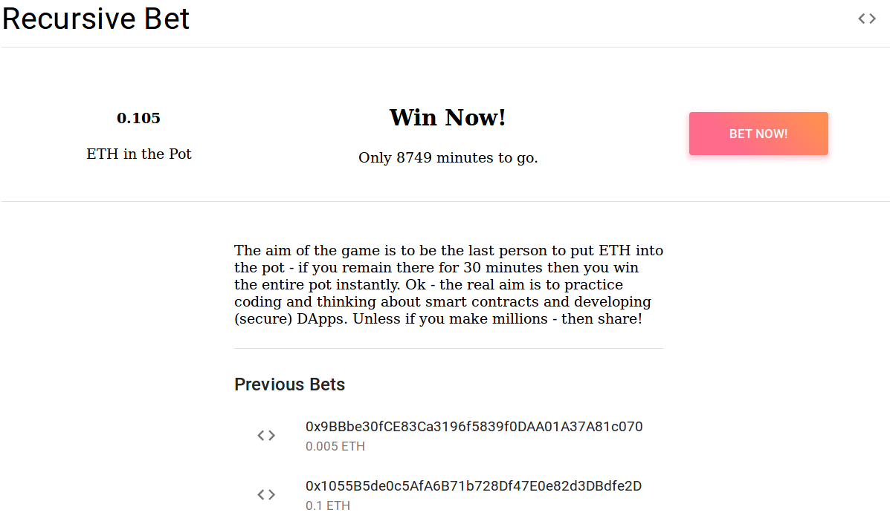

# A Decentralized Recursive Betting Application

[See The Live Demo on Ropsten](https://Tom2718.github.io/recursive-bet/)

The aim of the game is to be the last person to put Eth into the pot - if you are then you win the entire pot instantly.

Ok - the real aim is to practice coding and thinking about smart contracts and developing (secure) DApps.

The premise is inspired by the [Reddit Button](https://en.wikipedia.org/wiki/The_Button_(Reddit)).

## The Smart Contract

The Solidity smart contract that governs the game can be found in the contracts folder as `RecursiveDeposit.sol`. The contract is fairly simple in its implementation of buy ins and payouts.

## The Web Application

The front end is a React App found in the client directory. This is a simple user interface that interacts with web3 to allow the user to buy into the game.

The web app currently uses:

- React
- Material UI

## Contributing

You're more than welcome to contribute to the project. Simply make a pull request.

## To Do

- Add text field to enter amount of Ether to bet
- Add icons to previous user bets
- Notification on successful bet
- Notification on being outbet
- Update app screenshot

## Current App

